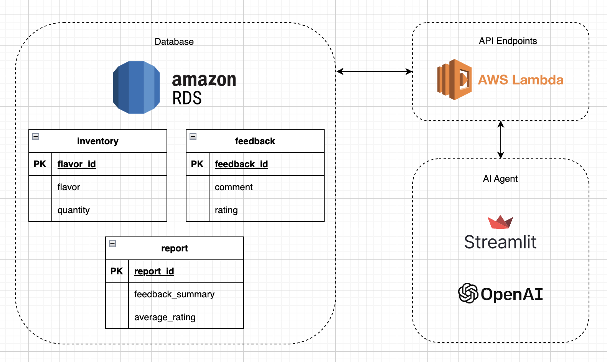

# The Menti Ice Cream Parlor

## Overview
The Menti Ice Cream Parlor is an interface designed to interact with a custom API, facilitating operations like menu retrieval, order placements, feedback submissions, inventory checks, restocking, and generating customer satisfaction reports. This project leverages AWS RDS for database management and AWS Lambda for API interactions.

- **API Docs**: [https://ujs5smnta2icm5oinwcfjdg2hy0rxtsa.lambda-url.ap-southeast-1.on.aws/docs](https://ujs5smnta2icm5oinwcfjdg2hy0rxtsa.lambda-url.ap-southeast-1.on.aws/docs)
- **Streamlit App**: [https://ice-cream-parlor.streamlit.app](https://ice-cream-parlor.streamlit.app)
- **Presentation**: [https://docs.google.com/presentation/d/1aYWSzC6dTUHuGYHPhKJnsNIPutD1Cv2U6faXsg2T610/edit?usp=sharing](https://docs.google.com/presentation/d/1aYWSzC6dTUHuGYHPhKJnsNIPutD1Cv2U6faXsg2T610/edit?usp=sharing)
- **Presentation PDF**: [https://github.com/leacornelio/icecream-parlor/blob/main/demo/documentation.pdf](https://github.com/leacornelio/icecream-parlor/blob/main/demo/documentation.pdf)

## Demo


## Design Rationale


- **AWS RDS**: Used for its scalability and flexible schema management, essential for adding new tables.
- **AWS Lambda**: Selected for its efficiency in handling API calls, auto-scaling, high availability, and a cost-effective model.
- **Streamlit**: 
    - User-Friendly Interface: Provides an intuitive interface, making it easier for users to interact with the AI agent.
    - Simplified Deployment: Straightforward deployment process - only needs a Streamlit app and a Github repo

## Set-up Instructions
### Creating Tables in AWS RDS
1. Create an RDS instance on AWS.
2. Use the following functions in [app.py](https://github.com/leacornelio/icecream-parlor/blob/main/app.py) to create inventory, feedback, and report tables:
    - `create_inventory_table()`
    - `create_feedback_table()`
    - `create_report_table()`
    - `delete_table()`

### Deploying to AWS Lambda
**API Docs**: [https://ujs5smnta2icm5oinwcfjdg2hy0rxtsa.lambda-url.ap-southeast-1.on.aws/docs](https://ujs5smnta2icm5oinwcfjdg2hy0rxtsa.lambda-url.ap-southeast-1.on.aws/docs)

1. **Build Docker Image**:
  ```
  docker build -t icecreamparlor .
  ```
2. **ECR Setup**:
- Set up AWS CLI.
- Create an AWS ECR repository and take note of repo url.
- Get ECR password and pipe/pass to Docker login:
  ```
  aws ecr get-login-password
  docker login -u AWS -p <password> <repo_url>
  docker tag icecreamparlor:latest <repo_url>/icecreamparlor:latest
  ```
3. **Push Image to ECR**:
  ```
  docker push <repo_url>/icecreamparlor:latest
  ```
4. **Lambda Function**:
- Create a Lambda function with container image

## Sample curl Commands
- **Ordering**: `curl -X POST [API_ENDPOINT]/order -H "Content-Type: application/json" -H "Authorization: Bearer 1337" -d '{"item": "vanilla", "quantity": 2}'`
- **Restocking**: [Similar command with /restock endpoint]
- **Submitting Feedback**: [Similar command with /feedback endpoint]
- **Submitting a Report**: [Similar command with /report endpoint]
- **Fetching the Menu**: `curl -X GET [API_ENDPOINT]/menu -H "Authorization: Bearer 1337"`
- **Fetching Inventory**: [Similar command with /inventory endpoint]
- **Fetching Feedbacks**: [Similar command with /feedback endpoint]
- **Fetching Reports**: [Similar command with /report endpoint]

## AI Agent
- Built using OpenAI API - gpt-4-turbo-preview model
- Recognize user request type - can accept multiple items when ordering and restocking
- Extract necessary data (items, quantities, comments, feedbacks, ratings). 
- Send data as payload to the correct API endpoints.
- Can be found in [agent.py](https://github.com/leacornelio/icecream-parlor/blob/main/agent.py)

## Streamlit app
**Streamlit App**: [https://ice-cream-parlor.streamlit.app](https://ice-cream-parlor.streamlit.app)

1. **Build the Steamlit App**: Streamlit app can be found in agent.py
2. **Test locally**: 
  ```
  streamlit run agent.py
  ```
3. **Deploy to Streamlit**:
- Upload to Github repository
- Deploy via Github link


## Challenges and Solutions

### Post-processing and Formatting Output
- **Challenge**: Post-processing and formatting output from API to be user-readable.
- **Solution**: Map each output format of endpoints to a target format that is appropriate for the user request. This ensures that the information presented to the user is clear and understandable.

### Handling Corner Cases in Orders and Restocking
- **Challenge**: Considering corner cases like multiple items in orders and restocking, as well as handling out-of-stock items.
- **Solution**: 
  - Prompt the AI agent to output a list of items for order and restock requests. Then, pass each item individually to the API to match the payload format for order and restock endpoints.
  - Utilize the inventory endpoint to check for out-of-stock items, ensuring that the system accurately reflects current stock levels and informs users appropriately.
